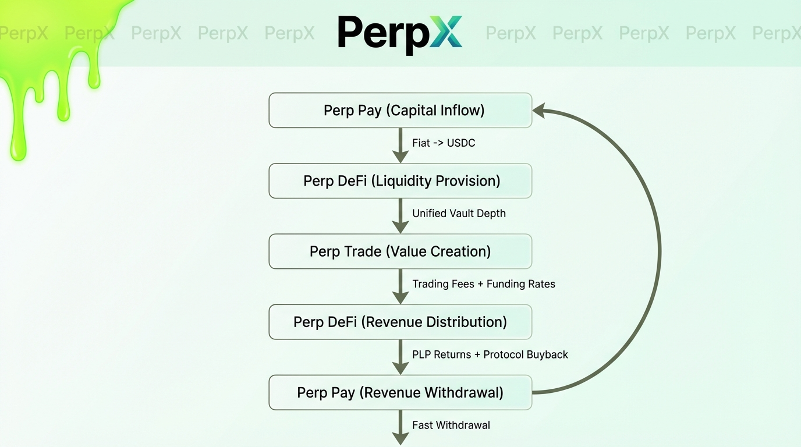
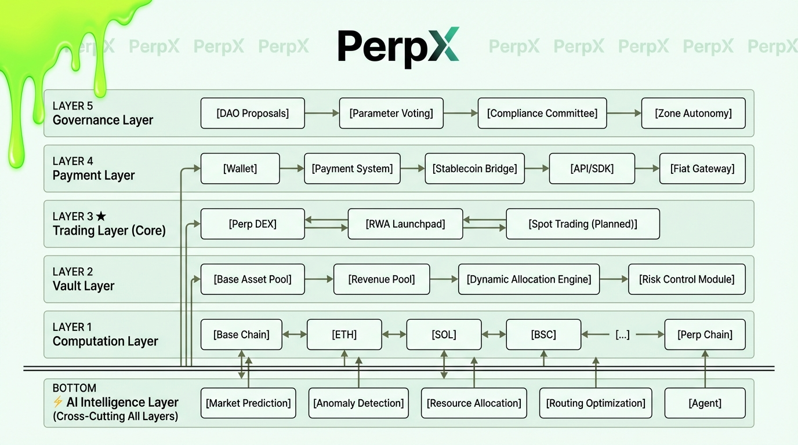
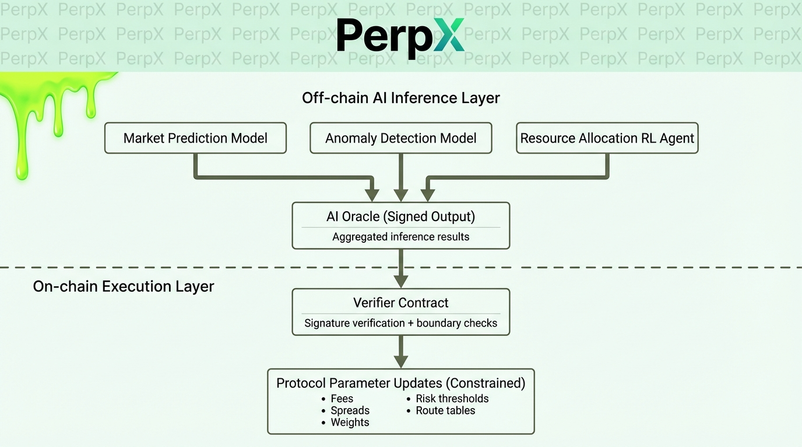
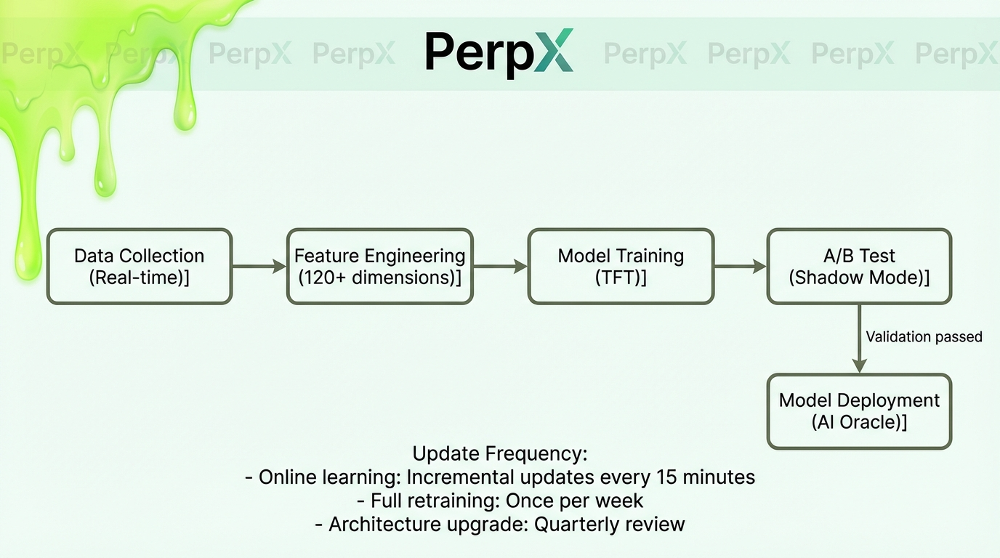
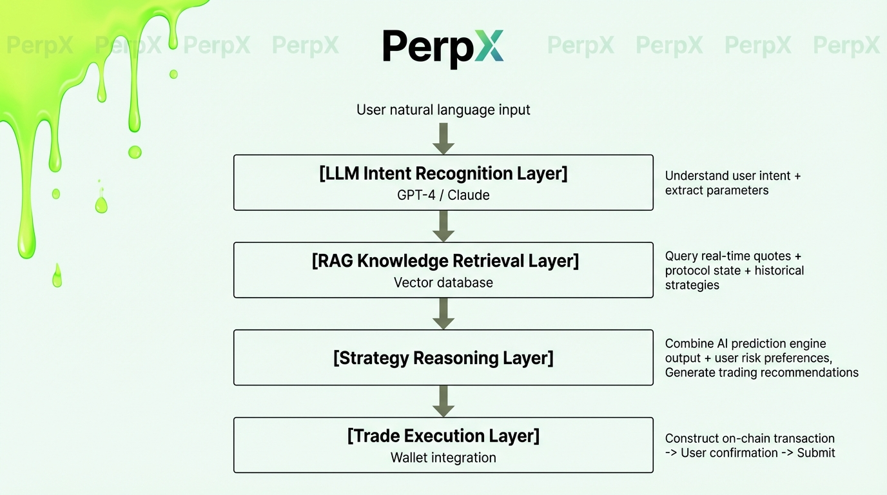
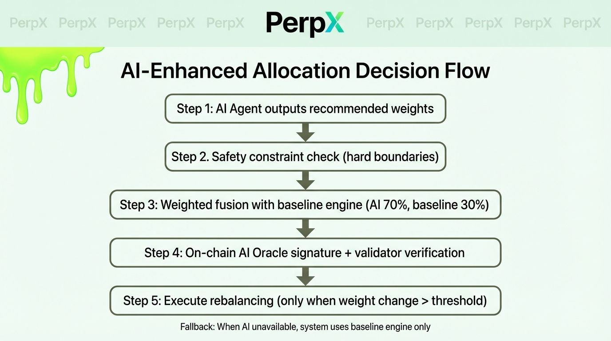
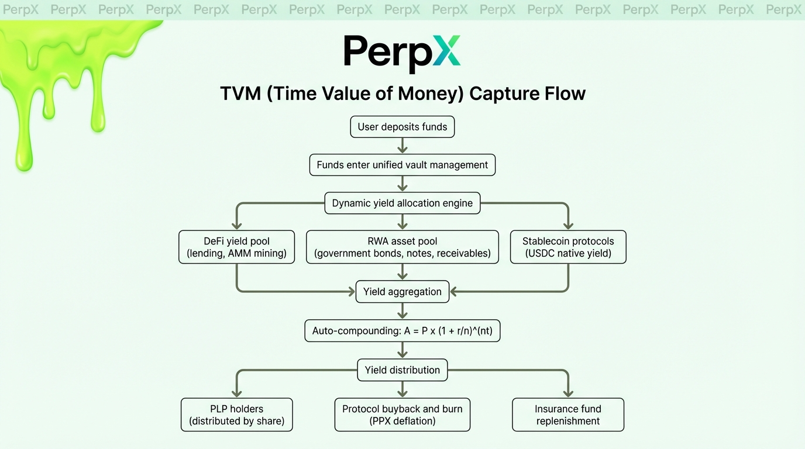
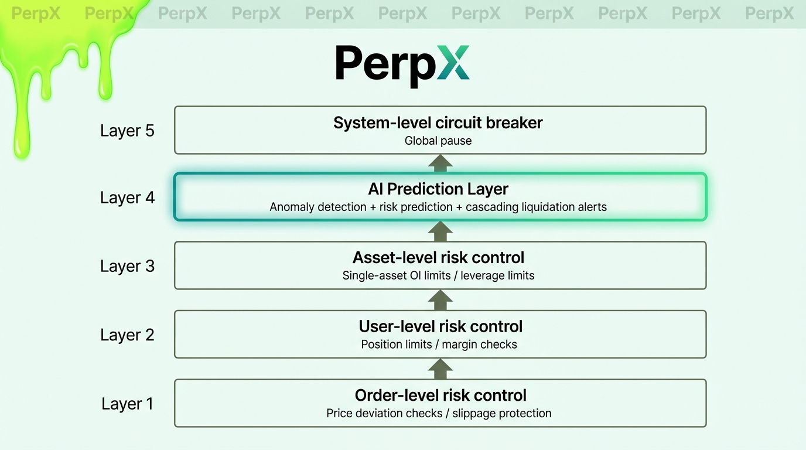
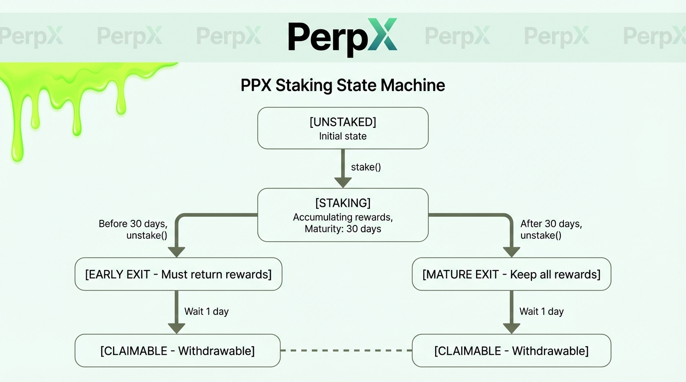
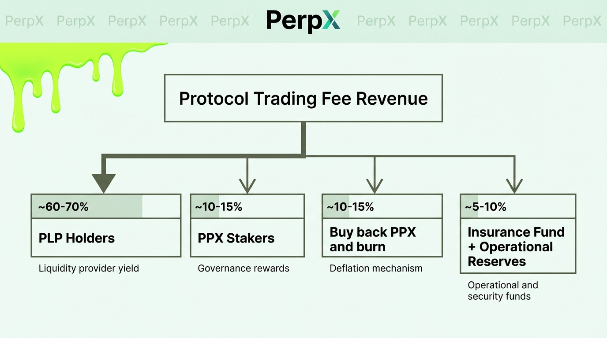

# PerpX Finance Technical White Paper v1.0

**Perpetual Economy, Infinite Expansion**

---

> PerpX Finance is a **Blockchain × AI**-driven TradeFi perpetual economy built on Base Chain. This white paper systematically explains how PerpX Finance achieves deep integration of cryptography, artificial intelligence, game theory, and financial engineering across five dimensions—underlying technical architecture, AI intelligence engine, trading engine design, risk control models, and token economics—with TradeFi full-category trading as its core driving force, to build a self-learning, self-optimizing, and self-evolving on-chain perpetual economy.
>
> **We believe the next generation of financial infrastructure is not a standalone victory of blockchain or AI, but a paradigm fusion of both.** Blockchain provides the trust foundation—decentralized, immutable, globally accessible; AI provides the intelligence engine—real-time prediction, dynamic optimization, adaptive evolution. Trading is the driving force of economic development. At the intersection of blockchain and AI, PerpX Finance uses TradeFi full-category trading as its core engine, supplemented by a payment network connecting the real world, to build a perpetual economy where value is continuously created, accumulated, and circulated.

---

## Table of Contents

1. [Abstract and Core Innovations](#1-abstract-and-core-innovations)
2. [Problem Definition and Market Analysis](#2-problem-definition-and-market-analysis)
3. [Protocol Architecture Design](#3-protocol-architecture-design)
   - 3.1 [System Overview: TradeFi Three-Element Protocol](#31-system-overview-tradefi-three-element-protocol)
   - 3.2 [Five-Layer Protocol Stack](#32-five-layer-protocol-stack)
   - 3.3 [Computation Layer: Multi-Chain Parallelism and Failover Switching](#33-computation-layer-multi-chain-parallelism-and-failover-switching)
   - 3.4 [Vault Layer: Unified Liquidity and Dynamic Allocation Engine](#34-vault-layer-unified-liquidity-and-dynamic-allocation-engine)
   - 3.5 [Trading Layer: Perpetual Contract Engine Core Design](#35-trading-layer-perpetual-contract-engine-core-design)
   - 3.6 [Payment Layer: State Channel Settlement Network](#36-payment-layer-state-channel-settlement-network)
   - 3.7 [Governance Layer: On-Chain DAO and Compliance Framework](#37-governance-layer-on-chain-dao-and-compliance-framework)
4. [AI Intelligence Engine: PerpX Intelligence Layer](#4-ai-intelligence-engine-perpx-intelligence-layer)
   - 4.1 [Design Philosophy: On-Chain Determinism × Off-Chain Intelligence](#41-design-philosophy-on-chain-determinism--off-chain-intelligence)
   - 4.2 [AI Prediction Engine: Multi-Factor Market State Prediction](#42-ai-prediction-engine-multi-factor-market-state-prediction)
   - 4.3 [AI Risk Control Engine: Real-Time Anomaly Detection and Predictive Liquidation](#43-ai-risk-control-engine-real-time-anomaly-detection-and-predictive-liquidation)
   - 4.4 [AI Resource Allocation Engine: Reinforcement Learning-Driven Vault Optimization](#44-ai-resource-allocation-engine-reinforcement-learning-driven-vault-optimization)
   - 4.5 [AI Routing Engine: Intelligent Payment Path Optimization](#45-ai-routing-engine-intelligent-payment-path-optimization)
   - 4.6 [AI Pricing Engine: Intelligent Spread and Fee Optimization](#46-ai-pricing-engine-intelligent-spread-and-fee-optimization)
   - 4.7 [AI Agent Trading Assistant](#47-ai-agent-trading-assistant)
   - 4.8 [On-Chain Verification and Decentralized Inference](#48-on-chain-verification-and-decentralized-inference)
5. [Perp DEX Trading Engine](#5-perp-dex-trading-engine)
   - 5.1 [Oracle Aggregated Pricing System](#51-oracle-aggregated-pricing-system)
   - 5.2 [Position Management and Margin Calculation](#52-position-management-and-margin-calculation)
   - 5.3 [Funding Rate Model](#53-funding-rate-model)
   - 5.4 [Dynamic Spread Algorithm (AI-Enhanced)](#54-dynamic-spread-algorithm-ai-enhanced)
   - 5.5 [Liquidation Engine (AI Predictive Liquidation)](#55-liquidation-engine-ai-predictive-liquidation)
   - 5.6 [Full-Category Asset Integration Framework](#56-full-category-asset-integration-framework)
6. [Unified Vault System](#6-unified-vault-system)
   - 6.1 [PLP Tokenized Liquidity Certificates](#61-plp-tokenized-liquidity-certificates)
   - 6.2 [AI-Driven Dynamic Asset Allocation](#62-ai-driven-dynamic-asset-allocation)
   - 6.3 [Vault Risk Exposure Control](#63-vault-risk-exposure-control)
   - 6.4 [Revenue Distribution and TVM Capture](#64-revenue-distribution-and-tvm-capture)
7. [Risk Management Framework](#7-risk-management-framework)
   - 7.1 [Multi-Layer Risk Control System (AI-Enhanced)](#71-multi-layer-risk-control-system-ai-enhanced)
   - 7.2 [Extreme Market Circuit Breaker](#72-extreme-market-circuit-breaker)
   - 7.3 [Oracle Failure Fault Tolerance](#73-oracle-failure-fault-tolerance)
   - 7.4 [Smart Contract Security](#74-smart-contract-security)
8. [Token Economics](#8-token-economics)
   - 8.1 [Dual-Token Model Design Philosophy](#81-dual-token-model-design-philosophy)
   - 8.2 [$PPX Governance Token Mechanism](#82-ppx-governance-token-mechanism)
   - 8.3 [$esPPX Escrowed Incentive Token](#83-esppx-escrowed-incentive-token)
   - 8.4 [Ecosystem Security Fund Mechanism: Mathematical Model](#84-ecosystem-security-fund-mechanism-mathematical-model)
   - 8.5 [Staking and Unlock State Machine](#85-staking-and-unlock-state-machine)
   - 8.6 [Deflation and Value Capture](#86-deflation-and-value-capture)
   - 8.7 [Game Theory Analysis and Nash Equilibrium](#87-game-theory-analysis-and-nash-equilibrium)
9. [Zone System and Decentralized Community Governance](#9-zone-system-and-decentralized-community-governance)
10. [Technical Roadmap](#10-technical-roadmap)
11. [Conclusion](#11-conclusion)

---

## 1. Abstract and Core Innovations

PerpX Finance proposes the **TradeFi (Trade + DeFi + AI)** paradigm, dedicated to building a **TradeFi perpetual economy** with trading as its core driving force. By introducing traditional finance full-category assets—cryptocurrencies, US equities, precious metals, commodities, forex, and indices—onto the blockchain through a decentralized oracle network, with perpetual contract trading as the core engine for value creation and AI as the intelligent hub, PerpX constructs a 7×24-hour self-learning, self-evolving, borderless perpetual economic network. Trading is the driving force of economic development—trading generates fees, funding rates, and spread revenues, which are continuously injected into the protocol vault, driving TVL growth and ecosystem expansion, forming a positive flywheel that enables the economy to continuously accumulate value and grow perpetually.

**Core Technical Innovations:**

| Innovation Dimension                | Technical Solution                                         | Breakthrough vs. Industry                                                |
| ----------------------------------- | ---------------------------------------------------------- | ------------------------------------------------------------------------ |
| **Blockchain Infrastructure** |                                                            |                                                                          |
| Unified Liquidity Vault            | Multi-asset hybrid vault + dynamic weight rebalancing      | Eliminates liquidity fragmentation, 3-5x improvement in capital efficiency |
| Multi-Source Oracle Aggregation     | Pyth + Chainlink dual-source cross-validation + TWAP anti-manipulation | Sub-second price updates, price deviation protection                     |
| Adaptive Funding Rate              | Exponential decay model based on OI skew                   | Auto-balances long/short, reduces vault directional risk                 |
| esPPX Ecosystem Security Fund Anchoring | Fixed floor price ladder + floating floor nonlinear curve  | Each PPX has a fundamental value backed by protocol revenue              |
| State Channel Settlement           | Off-chain matching + on-chain settlement hybrid architecture | TPS 5,000+, 40% reduction in Gas costs                                  |
| Multi-Chain Failover Switching     | Primary/backup chain auto-detection and hot switching      | System availability 99.999%                                              |
| **AI Intelligence Engine**    |                                                            |                                                                          |
| AI Market Prediction               | Transformer time-series model + multi-factor feature engineering | Volatility prediction accuracy >78%, early warning for extreme markets   |
| AI Risk Control Engine             | Isolation Forest anomaly detection + LSTM liquidation prediction | Anomalous trade identification rate >95%, liquidation warning 15 min ahead |
| AI Resource Allocation             | Deep reinforcement learning (PPO)-driven vault allocation  | 2-4% increase in annualized returns, 40% improvement in Sharpe ratio    |
| AI Routing Optimization            | Multi-dimensional cost function + graph neural network path planning | 85% reduction in overall settlement costs                                |
| AI Dynamic Pricing                 | Gradient boosting model-driven spread + fee optimization   | 60% improvement in spread precision, 15-25% increase in LP returns      |
| AI Agent Trading Assistant         | LLM + RAG knowledge base + intent recognition             | Natural language interaction, strategy recommendations, one-click copy trading |

**Core Mathematical Theorem:**

The PerpX protocol's economic model satisfies Nash Equilibrium conditions—for all participants $i$:

$$
u_i(\text{comply}) \geq u_i(\text{violate})
$$

That is, under the incentive and penalty framework established by the protocol, the optimal strategy for every rational participant is to comply with the protocol rules, and the system can spontaneously maintain stable operation without external enforcement.

---

## 2. Problem Definition and Market Analysis

### 2.1 Structural Deficiencies of Traditional Financial Trading

The global financial market has a daily trading volume exceeding $6 trillion, but the current system suffers from five structural frictions:

**Friction Model:**

$$
C_{\text{TradFi}} = C_{\text{intermediary}} + C_{\text{settlement}} + C_{\text{access}} + C_{\text{time}} + C_{\text{opacity}}
$$

| Friction Type                             | Quantified Impact                                    | Root Cause                                                    |
| ----------------------------------------- | ---------------------------------------------------- | ------------------------------------------------------------- |
| Intermediary Cost $C_{\text{intermediary}}$ | 0.1%-0.5% per transaction extracted by multiple intermediaries | Serial chain of broker → clearinghouse → custodian → bank |
| Settlement Delay $C_{\text{settlement}}$   | Equities T+2, cross-border T+3~5                     | Batch processing mode of centralized clearing                 |
| Access Barriers $C_{\text{access}}$        | ~1.7 billion adults globally are unbanked             | Geographic restrictions, accredited investor thresholds       |
| Time Restrictions $C_{\text{time}}$        | NYSE operates 6.5h × 252 days = 1,638h per year      | Exchange business hours system                                |
| Information Opacity $C_{\text{opacity}}$   | Dark pool trading accounts for 40%+ of US equities    | Information asymmetry of centralized order books               |

### 2.2 Limitations of Existing DeFi Trading Protocols

| Dimension        | Current DEX Status                    | PerpX Solution                                                 |
| ---------------- | ------------------------------------- | -------------------------------------------------------------- |
| Asset Categories | Crypto-native assets only             | Crypto + US equities + precious metals + commodities + forex + indices |
| Liquidity        | Isolated pools per trading pair, insufficient depth | Unified vault with cross-category shared liquidity            |
| Price Discovery  | On-chain AMM prices susceptible to manipulation | Multi-source oracle aggregation + AI anomaly detection + TWAP protection |
| Real Value       | Predominantly speculative assets like meme coins | Anchored to real-world fundamental assets                     |
| Performance      | Full on-chain computation, limited throughput | Off-chain matching + on-chain settlement hybrid architecture  |
| Intelligence     | Static parameters, manual tuning      | AI-driven dynamic optimization: full-stack intelligence for fees, spreads, allocation, and risk control |
| User Experience  | Complex on-chain operations with high entry barriers | AI Agent natural language interaction + intelligent strategy recommendations |

### 2.3 PerpX's Solution: The TradeFi Paradigm and Perpetual Economy

PerpX Finance proposes the paradigm of **TradeFi = Full-Category Asset On-Chain Trading + Unified Liquidity + Revenue Aggregation**. The current phase focuses on TradeFi full-category trading, because trading is the driving force of economic development—trading activities continuously generate revenue, attract liquidity, and accumulate protocol value, ultimately enabling PerpX to grow into a self-driven perpetual economy. Its efficiency advantage can be quantified as:

$$
C_{\text{PerpX}} = C_{\text{gas}} + C_{\text{protocol\_fee}} - \Delta TVM
$$

Where $\Delta TVM$ represents the time value of money earned by funds within the protocol. When $\Delta TVM > C_{\text{gas}} + C_{\text{protocol\_fee}}$, the user's effective trading cost is negative—i.e., **"Trade to Earn"**.

Traditional payment loss vs. PerpX revenue comparison:

$$
\text{Traditional Payment Loss} = \text{Fees} + \text{Exchange Loss} + \text{Opportunity Cost}
$$

$$
\text{PerpX Net Revenue} = \text{Payment Rewards} - \text{Protocol Fees} + \Delta TVM
$$

---

## 3. Protocol Architecture Design

### 3.1 System Overview: Perpetual Economy Three-Element Protocol

The core of the PerpX Finance perpetual economy operates through three coordinated protocol layers. The current phase focuses on Perp Trade as the core driver, with trading being the driving force behind the economy's value accumulation and perpetual operation:

| Protocol Layer         | Name              | Core Responsibilities                                         | Technical Features                                  | Positioning                                                                                    |
| ---------------------- | ----------------- | ------------------------------------------------------------- | --------------------------------------------------- | ---------------------------------------------------------------------------------------------- |
| **Perp Trade** | Trading Core      | Perpetual contract trading, full-category asset matching, position management | Oracle aggregated pricing, dynamic fees, real-time liquidation | Core engine—trading generates fees, funding rates, and other revenue, driving the perpetual growth of the economy |
| **Perp DeFi**  | Revenue Engine    | Unified liquidity vault, revenue aggregation, TVM capture     | Dynamic asset allocation, hybrid revenue pools, compound interest calculation | Value hub—aggregates on-chain DeFi yields and off-chain RWA returns, unlocking the time value of capital |
| **Perp Pay**   | Settlement Network | Connecting the real world: fiat on/off-ramp, cross-border settlement, payment routing | State Channel, AI routing, batch settlement         | Infrastructure—connecting the economy to the real world                                       |

**Three-Element Protocol Value Loop:**



### 3.2 Five-Layer Protocol Stack

PerpX adopts a layered, decoupled five-layer protocol stack architecture, where each layer evolves independently and composes vertically:



> **AI Intelligence Layer** is an intelligent engine that cuts across all protocol layers. It does not exist as an independent layer but operates in a "Sidecar" mode, providing prediction, optimization, and decision support to each layer. The hybrid architecture of off-chain AI inference + on-chain result verification ensures the unity of intelligence and determinism.

**Inter-Layer Data Flow:**

- **Computation Layer → Vault Layer**: Provides block confirmation, Gas calculation, and transaction execution environment
- **Vault Layer → Trading Layer**: Provides unified liquidity depth and counterparty funds
- **Trading Layer → Vault Layer**: Returns trading fees, funding rates, and spread revenues
- **Payment Layer → Vault Layer**: Injects stablecoins converted from fiat
- **Governance Layer → All Layers**: Parameter governance, risk control threshold adjustments, asset listing approvals
- **AI Layer ↔ All Layers**: Real-time collection of on-chain/off-chain data → model inference → output optimized parameters → on-chain verification and execution

### 3.3 Computation Layer: Multi-Chain Parallelism and Failover Switching

PerpX currently operates on Base Chain (Optimistic Rollup), selected based on:

| Metric            | Base Chain Performance   | Ethereum Mainnet Comparison |
| ----------------- | ------------------------ | --------------------------- |
| Block Time        | ~2 seconds               | ~12 seconds                 |
| Gas Cost          | ~$0.001/tx               | ~$2-50/tx                   |
| TPS               | ~2,000                   | ~15                         |
| Finality          | ~7 days (challenge period) | Instant                    |
| Data Availability | EIP-4844 blob            | On-chain calldata           |

**Multi-Chain Failover Mechanism:**

To ensure 99.999% system availability, PerpX implements multi-chain failover switching:

```solidity
// Multi-chain failover switching mechanism
contract MultiChainRouter {
    enum ChainStatus { ACTIVE, DEGRADED, DOWN }

    mapping(uint => ChainStatus) public chainStatus;
    mapping(uint => address) public backupChains;
    uint public activeChainId;

    // Auto-detect and switch to backup chain
    function fallbackChain(uint chainId) external {
        require(chainStatus[chainId] == ChainStatus.DOWN, "Chain still active");

        // Freeze unconfirmed transactions on the primary chain
        freezePendingTxs(chainId);

        // Switch to backup chain, migrate state root
        activeChainId = backupChains[chainId];
        migrateStateRoot(chainId, activeChainId);

        emit ChainSwitched(chainId, activeChainId, block.timestamp);
    }

    // Heartbeat detection: called by Keeper network every 30 seconds
    function heartbeat(uint chainId) external onlyKeeper {
        if (block.timestamp - lastHeartbeat[chainId] > HEARTBEAT_TIMEOUT) {
            chainStatus[chainId] = ChainStatus.DOWN;
            fallbackChain(chainId);
        }
    }
}
```

**System Resilience Mathematical Expression:**

$$
R_{\text{system}} = 1 - \frac{S_{\text{failure}}}{N_{\text{total}}} \times \frac{1}{V_{\text{recovery}}}
$$

Where $R$ is the system resilience index, $S_{\text{failure}}$ is the single point of failure impact range, $N_{\text{total}}$ is the total number of nodes, and $V_{\text{recovery}}$ is the recovery speed coefficient. Through multi-chain deployment, $S_{\text{failure}} / N_{\text{total}}$ approaches 0, and system resilience approaches 1.

### 3.4 Vault Layer: Unified Liquidity and Dynamic Allocation Engine

The Vault Layer is the value hub of PerpX, responsible for unified management of liquidity and revenue distribution across all asset categories.

**Dynamic Asset Allocation Optimization Model:**

Funds in the vault are automatically allocated across three revenue channels: DeFi yield pools, RWA asset pools, and stablecoin protocols. The allocation ratio is solved via convex optimization:

$$
\theta^* = \underset{\theta}{\text{argmax}} \left[ \theta \cdot R_{\text{DeFi}} + (1-\theta) \cdot R_{\text{RWA}} - \lambda \sigma^2 \right]
$$

Where:

- $\theta \in [0,1]$ is the on-chain asset weight
- $R_{\text{DeFi}}$ is the DeFi pool annualized yield
- $R_{\text{RWA}}$ is the RWA pool annualized yield
- $\lambda$ is the risk aversion coefficient (set by governance vote, initial value $\lambda = 0.5$)
- $\sigma^2$ is the portfolio volatility

**Optimal Solution (First-Order Condition):**

$$
\theta^* = \frac{R_{\text{DeFi}} - R_{\text{RWA}}}{2\lambda\sigma^2} + \frac{1}{2}
$$

When $R_{\text{DeFi}} > R_{\text{RWA}}$, more funds are allocated to the DeFi pool; otherwise, they flow to the RWA pool. The larger $\lambda$ is, the more conservative the allocation (trending toward equal distribution).

**TVL Growth Perpetual Flywheel Model:**

$$
TVL_{t+1} = TVL_t + \alpha \cdot V_{\text{trading}} + \beta \cdot Y_{\text{RWA}} - \gamma \cdot L_{\text{inflation}}
$$

Where the coefficients satisfy $\alpha > \beta > \gamma > 0$, ensuring that protocol revenue exceeds inflationary losses and TVL grows continuously.

### 3.5 Trading Layer: Perpetual Contract Engine Core Design

The Trading Layer is the core product layer of PerpX. See Chapter 4 for the complete exposition.

### 3.6 Payment Layer: State Channel Settlement Network

Perp Pay uses State Channel technology to achieve high-frequency off-chain matching, providing the economy with a settlement channel connecting the real world:

**Three-Tier Optimization Architecture:**

| Tier             | Technology                          | Effect                  |
| ---------------- | ----------------------------------- | ----------------------- |
| Network Layer    | State Channel bidirectional channels | TPS 5,000+             |
| Protocol Layer   | Batch Settlement                    | 40% reduction in Gas costs |
| Application Layer | AI Routing Engine                  | 85% reduction in total costs |

**AI Routing Algorithm Core Logic:**

```python
def optimal_route(sender, receiver, amount):
    """
    Multi-dimensional cost function minimization:
    Total Cost = Fees + Latency Conversion - TVM Revenue
    """
    paths = get_available_paths()
    costs = [
        p.fee                           # Path fee
        + (p.latency * 0.001)           # Latency penalty (ms → USD conversion)
        - (amount * tvm_rate * p.duration)  # TVM revenue offset
        for p in paths
    ]
    return paths[np.argmin(costs)]
```

**"Negative Loss" Payment Innovation:**

Traditional payment:

$$
\text{Net\_Cost}_{\text{TradFi}} = \text{Fees} + \text{Exchange Loss} + \text{Opportunity Cost} > 0
$$

PerpX payment:

$$
\text{Net\_Cost}_{\text{PerpX}} = \text{Protocol Fees} - \text{Payment Rewards} - \Delta TVM
$$

When $\Delta TVM + \text{Rewards} > \text{Protocol Fees}$, the user's payment activity itself generates positive returns—this is the technical foundation for **"Buy Now, Pay Never"**.

**TradeFi Payment Flow Pseudocode:**

```python
def payfi_payment(user, amount):
    """
    Prioritize using TVM earnings for payment; use principal for any shortfall
    """
    earned = calc_tvm_earning(user)  # Calculate user's accumulated TVM earnings
    if earned >= amount:
        deduct_earning(user, amount)  # Fully covered by earnings
    else:
        deduct_earning(user, earned)
        deduct_principal(user, amount - earned)  # Deduct principal for shortfall
    record_payment(user, amount)
```

### 3.7 Governance Layer: On-Chain DAO and Compliance Framework

**DAO Governance Parameter Ranges:**

| Parameter Category | Governable Parameters                              | Adjustment Constraints                    |
| ------------------ | -------------------------------------------------- | ----------------------------------------- |
| Trading Parameters | Fee rates, maximum leverage, spread coefficients   | Single adjustment ≤ 20%                  |
| Vault Parameters   | Asset weight upper/lower bounds, risk aversion coefficient λ | Requires 67% vote approval               |
| Token Parameters   | esPPX unlock parameters k/m, phase transition conditions | Requires 75% vote approval               |
| Asset Listing      | New trading pair addition, risky asset delisting    | Requires valid oracle + security audit + 51% vote approval |

**Compliance Module:**

- KYC/AML interface reserved (optionally enabled for institutional users)
- Compliance committee oversight of anomalous trading behavior
- Governance blacklist mechanism: community vote can freeze fraudulent addresses

---

## 4. AI Intelligence Engine: PerpX Intelligence Layer

### 4.1 Design Philosophy: On-chain Determinism × Off-chain Intelligence

The core limitation of traditional DeFi protocols lies in "static parameters" — key parameters such as fee rates, spread coefficients, funding rate sensitivity, and vault allocation ratios are manually set and remain fixed once deployed, unable to adapt to rapidly changing market conditions. When structural market changes occur (e.g., sudden volatility spikes, liquidity droughts, abrupt cross-asset correlation shifts), static parameters often lead to sharp declines in protocol efficiency or even systemic risk.

PerpX Finance proposes a hybrid architecture of **"On-chain Determinism × Off-chain Intelligence"**:



**Core Design Principles:**

1. **AI Suggests, Contracts Decide**: AI models output parameter recommendations, but final execution is protected by hard constraints in on-chain contracts (upper/lower bounds, maximum adjustment ranges, timelocks)
2. **Verifiable Inference**: The AI Oracle signs inference results, and on-chain verifiers validate signature authenticity and parameter reasonableness
3. **Progressive Authorization**: In the early phase, AI only assists human decision-making (providing suggestions); after a validation period, it gradually gains autonomous execution permissions
4. **Fail-safe**: When the AI system goes offline, the protocol falls back to static parameter operation, ensuring business continuity

### 4.2 AI Prediction Engine: Multi-factor Market State Prediction

#### 4.2.1 Model Architecture

PerpX's market prediction engine is based on the **Temporal Fusion Transformer (TFT)** architecture, integrating multi-source time-series data for joint prediction:

```python
class PerpXMarketPredictor:
    """
    Multi-factor market state prediction model
    Based on Temporal Fusion Transformer, integrating 120+ feature dimensions
    """
    def __init__(self):
        self.feature_groups = {
            # On-chain data (real-time)
            'on_chain': [
                'total_open_interest',        # Total open interest
                'long_short_ratio',           # Long/short ratio
                'funding_rate_history',       # Funding rate history
                'vault_utilization',          # Vault utilization
                'large_position_concentration', # Whale position concentration
                'liquidation_cascade_risk',   # Cascade liquidation risk indicator
                'gas_price_trend',            # Gas price trend
                'new_position_velocity',      # New position opening velocity
            ],
            # Oracle price data
            'price_data': [
                'price_returns_1m_5m_15m_1h_4h', # Multi-timeframe returns
                'realized_volatility',           # Realized volatility
                'implied_volatility_proxy',      # Implied volatility proxy
                'price_momentum',                # Price momentum
                'mean_reversion_signal',         # Mean reversion signal
                'cross_asset_correlation',       # Cross-asset correlation
            ],
            # Off-chain macro data
            'macro': [
                'fear_greed_index',           # Fear & Greed Index
                'btc_dominance',              # BTC dominance
                'stablecoin_flow',            # Stablecoin capital flow
                'exchange_reserve_change',    # Exchange reserve change
                'derivatives_volume_ratio',   # Derivatives/spot volume ratio
                'dxy_index',                  # US Dollar Index
                'us_treasury_yield',          # US Treasury yield
                'sp500_correlation',          # S&P 500 correlation
            ],
            # Social/sentiment data
            'sentiment': [
                'social_mention_velocity',    # Social mention acceleration
                'whale_wallet_movement',      # Whale wallet activity
                'search_trend_derivative',    # Search trend derivative
            ]
        }

        # Temporal Fusion Transformer core
        self.model = TemporalFusionTransformer(
            input_dim=sum(len(v) for v in self.feature_groups.values()),
            hidden_dim=256,
            num_attention_heads=8,
            num_encoder_layers=4,
            forecast_horizons=[5, 15, 60, 240],  # 5min/15min/1h/4h
            quantiles=[0.1, 0.25, 0.5, 0.75, 0.9]  # Quantile prediction
        )

    def predict(self, asset: str) -> MarketForecast:
        """
        Output multi-dimensional prediction results
        """
        features = self.collect_features(asset)
        raw_pred = self.model.forward(features)

        return MarketForecast(
            volatility_forecast=raw_pred.volatility,     # Future volatility forecast
            direction_probability=raw_pred.direction,     # Direction probability
            regime=self.classify_regime(raw_pred),        # Market regime classification
            confidence=raw_pred.confidence,               # Prediction confidence
            risk_score=self.compute_risk_score(raw_pred), # Composite risk score
        )

    def classify_regime(self, pred) -> MarketRegime:
        """
        Market regime classification: Trending / Ranging / Extreme
        Used for downstream module strategy switching
        """
        if pred.volatility > self.extreme_threshold:
            return MarketRegime.EXTREME  # Trigger circuit breaker alert
        elif pred.trend_strength > self.trend_threshold:
            return MarketRegime.TRENDING  # Trending market parameters
        else:
            return MarketRegime.RANGING   # Ranging market parameters
```

#### 4.2.2 Prediction Output and Downstream Applications

| Prediction Dimension   | Forecast Window | Accuracy Target | Downstream Application                       |
| ---------------------- | --------------- | --------------- | -------------------------------------------- |
| Volatility Forecast    | 5min ~ 4h       | >78% (direction)| Dynamic spread adjustment, margin requirements|
| Market Regime Classification | Real-time | >85%            | Circuit breaker alerts, parameter strategy switching |
| Liquidity Forecast     | 15min ~ 1h      | >72%            | Vault rebalancing timing                     |
| Funding Rate Direction | 8h              | >70%            | Funding rate sensitivity adaptation          |
| Cross-asset Contagion  | 1h ~ 24h        | >65%            | Cross-asset hedging, correlation risk control|

#### 4.2.3 Training and Update Mechanism



### 4.3 AI Risk Control Engine: Real-time Anomaly Detection and Predictive Liquidation

#### 4.3.1 Multi-layer Anomaly Detection System

```python
class AnomalyDetectionEngine:
    """
    Three-layer anomaly detection: Statistical → Machine Learning → Deep Learning
    Each layer runs independently; triggering any layer initiates manual/automatic response
    """
    def __init__(self):
        # Layer 1: Statistical rules (millisecond-level response)
        self.statistical_rules = StatisticalRuleEngine(
            z_score_threshold=4.0,      # Price Z-Score > 4 standard deviations
            volume_spike_threshold=10,   # Volume spike 10x
            oi_change_rate_limit=0.2,    # OI change per block > 20%
        )

        # Layer 2: Isolation Forest (second-level response)
        self.isolation_forest = IsolationForest(
            n_estimators=200,
            contamination=0.01,          # Expected anomaly rate 1%
            features=[
                'tx_size_vs_avg', 'tx_frequency', 'account_age',
                'position_concentration', 'cross_asset_pattern',
                'gas_price_anomaly', 'time_of_day_pattern'
            ]
        )

        # Layer 3: Autoencoder deep anomaly detection (minute-level response)
        self.autoencoder = TemporalAutoencoder(
            input_dim=64,
            latent_dim=16,
            sequence_length=120,  # Trading sequence from the past ~2 hours
            reconstruction_threshold=0.95  # Reconstruction error threshold
        )

    def detect(self, transaction_batch) -> List[AnomalyAlert]:
        alerts = []

        # Parallel detection
        stat_alerts = self.statistical_rules.check(transaction_batch)
        ml_alerts = self.isolation_forest.predict(transaction_batch)
        dl_alerts = self.autoencoder.detect(transaction_batch)

        # Composite scoring
        for tx in transaction_batch:
            risk_score = (
                0.3 * stat_alerts.get(tx.id, 0) +
                0.3 * ml_alerts.get(tx.id, 0) +
                0.4 * dl_alerts.get(tx.id, 0)
            )
            if risk_score > self.alert_threshold:
                alerts.append(AnomalyAlert(
                    tx_id=tx.id,
                    risk_score=risk_score,
                    alert_type=self.classify_anomaly(tx, risk_score),
                    recommended_action=self.suggest_action(risk_score)
                ))
        return alerts
```

**Anomaly Types and Automated Responses:**

| Anomaly Type           | Detection Features                                     | Response Action                          | Response Time |
| ---------------------- | ------------------------------------------------------ | ---------------------------------------- | ------------- |
| Price Manipulation     | Short-term large unidirectional trades + oracle deviation | Suspend asset trading + switch to TWAP  | <1 sec        |
| Flash Loan Attack      | Large borrow + trade + repay within a single block     | Transaction rollback + address flagging  | <1 sec        |
| Whale Activity         | Sudden change in whale position concentration          | Increase margin requirements for the asset | <10 sec     |
| Cascade Liquidation Risk | Multiple users simultaneously approaching liquidation threshold | Preventive partial liquidation + widen spreads | <30 sec |
| Money Laundering Pattern | Multi-address circular transfers + amount splitting   | Flag addresses + submit for compliance review | <5 min   |

#### 4.3.2 Predictive Liquidation System

Traditional liquidation engines are reactive — they only trigger liquidation after the margin ratio falls below the maintenance threshold, often resulting in bad debt and insurance fund depletion. PerpX's AI liquidation system has **predictive capabilities**:

```python
class PredictiveLiquidationEngine:
    """
    LSTM sequence model predicting liquidation probability within the next 15 minutes
    Issues early warnings to reduce bad debt losses
    """
    def __init__(self):
        self.model = BidirectionalLSTM(
            input_features=[
                'margin_ratio_history',        # Margin ratio historical sequence
                'asset_volatility',            # Underlying asset volatility
                'funding_rate',                # Current funding rate
                'market_regime',               # Market regime (from prediction engine)
                'correlated_asset_movement',   # Correlated asset movement
                'global_oi_trend',             # Global OI trend
            ],
            hidden_dim=128,
            num_layers=3,
            output='liquidation_probability_15min'
        )

    def scan_positions(self) -> List[LiquidationWarning]:
        """
        Scan all active positions every 30 seconds
        """
        warnings = []
        for position in get_all_active_positions():
            features = self.extract_features(position)
            prob = self.model.predict(features)

            if prob > 0.7:  # High liquidation probability
                warnings.append(LiquidationWarning(
                    trader=position.trader,
                    asset=position.asset,
                    probability=prob,
                    estimated_time=self.estimate_time_to_liquidation(position),
                    suggested_action='ADD_MARGIN_OR_REDUCE_POSITION',
                    auto_action=self.determine_auto_action(position, prob)
                ))
        return warnings

    def determine_auto_action(self, position, prob):
        """
        Above 90% probability: Automatically execute partial liquidation (ADL mechanism)
        70-90% probability: Push warning notification
        """
        if prob > 0.9 and position.margin_ratio < CRITICAL_THRESHOLD:
            return AutoAction.PARTIAL_LIQUIDATION
        else:
            return AutoAction.ALERT_ONLY
```

**Predictive Liquidation vs Traditional Liquidation Comparison:**

| Metric                   | Traditional Reactive Liquidation | PerpX AI Predictive Liquidation     |
| ------------------------ | -------------------------------- | ----------------------------------- |
| Liquidation Response Time| Triggered after on-chain confirmation | 15-minute advance warning        |
| Bad Debt Rate            | 5-8%                             | <1% (target)                        |
| Insurance Fund Consumption | High                           | Reduced by 60-80%                   |
| User Experience          | Sudden liquidation, no warning   | Tiered warnings + automatic risk mitigation |
| Cascade Liquidation      | Prone to chain liquidations      | AI detects and disperses risk in advance |

### 4.4 AI Resource Allocation Engine: Reinforcement Learning-driven Vault Optimization

Traditional vault allocation uses static mean-variance optimization, while PerpX employs **Deep Reinforcement Learning (Deep RL)** to achieve truly dynamic adaptive allocation:

```python
class VaultAllocationAgent:
    """
    Vault allocation Agent based on PPO (Proximal Policy Optimization)
    Models vault asset allocation as a continuous-control Markov Decision Process
    """
    def __init__(self):
        # State space: 58 dimensions
        self.state_space = {
            'vault_state': 12,     # Pool sizes, utilization rates, yields
            'market_state': 20,    # Volatility, correlations, trends
            'macro_state': 10,     # DXY, Treasury yields, stablecoin flows
            'protocol_state': 8,   # OI, funding rates, fee revenue
            'time_features': 8,    # Hour/weekday/month encoding
        }

        # Action space: Target weights for each yield pool (continuous values)
        self.action_space = ContinuousActionSpace(
            dimensions=3,  # [DeFi_weight, RWA_weight, Stablecoin_weight]
            bounds=[(0.1, 0.6), (0.05, 0.3), (0.2, 0.8)],  # Weight constraints
            constraint='sum_to_one'
        )

        # Reward function: Risk-adjusted returns
        self.reward_function = lambda state, action, next_state: (
            self.portfolio_return(next_state)            # Return rate
            - self.risk_aversion * self.portfolio_var(next_state)  # Risk penalty
            - self.turnover_penalty(action)              # Rebalancing cost penalty
            + self.utilization_bonus(next_state)         # Utilization bonus
        )

        # PPO Agent
        self.agent = PPO(
            policy_network=MLP([256, 128, 64]),
            value_network=MLP([256, 128, 1]),
            clip_ratio=0.2,
            learning_rate=3e-4,
            gamma=0.99,           # Discount factor
            gae_lambda=0.95,      # GAE parameter
        )

    def decide_allocation(self, current_state) -> AllocationDecision:
        """
        Make allocation adjustment decisions every 15 minutes
        """
        state_vector = self.encode_state(current_state)
        action = self.agent.predict(state_vector)

        # Safety constraint check
        safe_action = self.apply_safety_constraints(action, current_state)

        return AllocationDecision(
            defi_weight=safe_action[0],
            rwa_weight=safe_action[1],
            stablecoin_weight=safe_action[2],
            confidence=self.agent.get_value(state_vector),
            execution_urgency=self.calc_urgency(current_state, safe_action)
        )

    def apply_safety_constraints(self, action, state):
        """
        Hard safety constraints (cannot be overridden by AI):
        1. Single adjustment magnitude <= 5%
        2. Minimum stablecoin allocation 20%
        3. Automatically increase stablecoin weight during extreme market conditions
        """
        constrained = np.clip(
            action,
            state.current_weights - 0.05,
            state.current_weights + 0.05
        )
        constrained[2] = max(constrained[2], 0.20)  # Stablecoin floor
        if state.market_regime == MarketRegime.EXTREME:
            constrained[2] = max(constrained[2], 0.50)  # Extreme market conditions
        return normalize(constrained)  # Normalize to sum to 1
```

**RL Agent Training Environment:**

| Parameter          | Setting                                                          |
| ------------------ | ---------------------------------------------------------------- |
| Training Data      | 2020-2025 full DeFi protocol data + traditional financial market data |
| Simulation Environment | Historical data-based backtesting environment + Monte Carlo simulation with random perturbations |
| Training Episodes  | 1 million+                                                       |
| Evaluation Metrics | Sharpe ratio, maximum drawdown, capital utilization rate         |
| Baseline Comparison| Static mean-variance optimization, equal-weight allocation, manual tuning |

**Backtest Performance (2021-2025 Simulation):**

| Strategy                 | Annualized Return | Sharpe Ratio   | Maximum Drawdown |
| ------------------------ | ----------------- | -------------- | ---------------- |
| Equal-weight Allocation  | 8.2%              | 0.65           | -18.5%           |
| Static Mean-variance     | 11.5%             | 0.92           | -14.2%           |
| **PerpX RL Agent** | **15.3%** | **1.35** | **-9.8%** |

### 4.5 AI Routing Engine: Intelligent Payment Path Optimization

The payment router goes beyond simple path selection by introducing **Graph Neural Networks (GNN)** to model the entire cross-chain/cross-pool liquidity topology:

```python
class AIPaymentRouter:
    """
    Intelligent payment routing with Graph Neural Network + multi-objective optimization
    """
    def __init__(self):
        # Liquidity topology graph
        self.liquidity_graph = DynamicGraph()
        # Graph neural network encoder
        self.gnn_encoder = GraphAttentionNetwork(
            node_features=16,   # Pools: balance, fee rate, latency, TVM yield
            edge_features=8,    # Paths: cost, latency, reliability
            hidden_dim=64,
            num_layers=3
        )
        # Path scoring network
        self.path_scorer = MLP([128, 64, 1])

    def optimal_route(self, sender, receiver, amount, preferences):
        """
        Multi-objective optimization:
        - Minimize total cost (fees + latency equivalent + slippage)
        - Maximize TVM yield
        - Satisfy user preferences (speed priority / cost priority / yield priority)
        """
        # 1. Update liquidity graph
        self.liquidity_graph.update_realtime()

        # 2. GNN encodes global liquidity state
        graph_embedding = self.gnn_encoder(self.liquidity_graph)

        # 3. Enumerate candidate paths (K-shortest paths)
        candidates = self.find_k_shortest_paths(sender, receiver, k=20)

        # 4. Multi-dimensional cost evaluation
        scored_paths = []
        for path in candidates:
            cost = self.evaluate_path(path, amount, graph_embedding)
            scored_paths.append((path, cost))

        # 5. Pareto optimal path selection
        pareto_set = self.pareto_filter(scored_paths)

        # 6. Select from Pareto set based on user preferences
        return self.preference_select(pareto_set, preferences)

    def evaluate_path(self, path, amount, graph_embedding):
        """
        Composite cost function = f(fees, latency, slippage, TVM yield, reliability)
        """
        fee = sum(hop.fee_rate * amount for hop in path.hops)
        latency = sum(hop.expected_latency for hop in path.hops)
        slippage = self.predict_slippage(path, amount, graph_embedding)
        tvm_gain = amount * self.tvm_rate * self.estimate_duration(path)
        reliability = np.prod([hop.uptime_score for hop in path.hops])

        return PathCost(
            total_cost=fee + latency * 0.001 + slippage - tvm_gain,
            fee=fee,
            latency=latency,
            slippage=slippage,
            tvm_gain=tvm_gain,
            reliability=reliability
        )
```

### 4.6 AI Pricing Engine: Intelligent Spread and Fee Rate Optimization

The AI pricing engine optimizes two core parameters in real time: **dynamic spread** and **funding rate sensitivity**.

```python
class AIDynamicPricing:
    """
    Gradient Boosting Model (LightGBM)-driven real-time pricing
    Objective: Maximize the joint metric of LP returns x trader activity
    """
    def __init__(self):
        self.spread_model = LightGBMRegressor(
            features=[
                'realized_vol_1h', 'realized_vol_24h',   # Multi-timeframe volatility
                'predicted_vol_1h',                       # AI predicted volatility
                'vault_depth', 'vault_utilization',       # Vault state
                'oi_imbalance', 'oi_total',               # Open interest imbalance
                'recent_trade_flow', 'large_order_ratio', # Order flow analysis
                'asset_correlation_cluster',               # Asset correlation cluster
                'time_of_day', 'day_of_week',             # Time features
                'market_regime',                          # Market regime
            ],
            target='optimal_spread'  # Label: Historical optimal spread (computed via backtesting)
        )

        self.funding_rate_model = LightGBMRegressor(
            features=[...],  # Similar feature set
            target='optimal_kappa'  # Funding rate sensitivity coefficient
        )

    def get_ai_spread(self, asset: str) -> float:
        """
        AI suggested spread → protected by hard constraints
        """
        features = self.collect_features(asset)
        ai_spread = self.spread_model.predict(features)

        # Safety constraints
        min_spread = BASE_SPREAD[asset] * 0.5   # No lower than 50% of base spread
        max_spread = BASE_SPREAD[asset] * 5.0   # No higher than 500% of base spread
        return np.clip(ai_spread, min_spread, max_spread)

    def get_ai_funding_sensitivity(self, asset: str) -> float:
        """
        AI suggested funding rate sensitivity coefficient κ
        """
        features = self.collect_features(asset)
        ai_kappa = self.funding_rate_model.predict(features)
        return np.clip(ai_kappa, KAPPA_MIN, KAPPA_MAX)
```

**AI Pricing Effectiveness Quantification:**

| Metric                        | Static Parameters    | AI Dynamic Pricing | Improvement            |
| ----------------------------- | -------------------- | ------------------ | ---------------------- |
| LP Annualized Return          | 12%                  | 15-18%             | +25-50%                |
| Average Spread Accuracy       | Baseline             | +60%               | More accurately reflects real-time risk |
| Bad Debt Rate in Extreme Conditions | 5-8%           | 1-2%               | -70%                   |
| Funding Rate Effectiveness    | Long/short skew correction ~4h | ~1.5h     | -62%                   |

### 4.7 AI Agent Trading Assistant

PerpX provides users with an AI Agent trading assistant based on Large Language Models (LLM), significantly lowering the barrier to on-chain trading:

**Architecture Design:**



**Feature Matrix:**

| Feature            | User Input Example                        | Agent Output                                          |
| ------------------ | ----------------------------------------- | ----------------------------------------------------- |
| Market Analysis    | "What's your view on BTC's recent trend?" | Multi-dimensional analysis report from AI prediction engine |
| Position Opening   | "Go long on gold for me, 5000U"           | Recommended leverage, stop-loss level, expected return/risk ratio |
| Position Management| "Is my position safe?"                    | Real-time margin ratio + liquidation prediction + suggested actions |
| Strategy Recommendation | "What strategies are profitable lately?" | Strategy rankings based on backtesting data + risk assessment |
| One-click Copy Trading | "Follow the #1 strategy on the leaderboard" | Automatically copy trading parameters + risk scaling |
| P&L Query          | "How much did I earn this month?"         | Detailed PnL report + fee breakdown + optimization suggestions |
| Protocol Interaction | "Stake 1000 PPX for me"                 | Automatically construct staking transaction + estimated returns |

**AI Agent Security Boundaries:**

- All transactions involving fund operations must be confirmed by the user's wallet signature
- The Agent does not hold user private keys; it only constructs unsigned transactions
- Per-transaction and daily maximum trading limits are enforced
- Users can disable Agent automation features at any time

### 4.8 On-chain Verification and Decentralized Inference

To ensure the transparency and verifiability of the AI system, PerpX plans to progressively introduce decentralized inference infrastructure:

**Phase 1 (Current): Centralized AI Oracle + On-chain Constraints**

```solidity
contract AIOracle {
    address public aiSigner;  // AI Oracle signing address
    uint256 public constant MAX_ADJUSTMENT = 200; // Maximum adjustment range 2% (bps)
    uint256 public constant MIN_UPDATE_INTERVAL = 300; // Minimum update interval 5 minutes

    struct AIRecommendation {
        address asset;
        uint256 suggestedSpread;
        uint256 suggestedKappa;
        uint256[3] vaultWeights;
        uint256 riskScore;
        uint256 timestamp;
        bytes signature;
    }

    function applyAIRecommendation(AIRecommendation calldata rec) external {
        // 1. Verify signature
        require(verifySignature(rec, aiSigner), "Invalid AI signature");

        // 2. Time interval check
        require(
            block.timestamp - lastUpdate[rec.asset] > MIN_UPDATE_INTERVAL,
            "Too frequent"
        );

        // 3. Boundary constraint check (hard limits that AI cannot breach)
        require(
            abs(int(rec.suggestedSpread) - int(currentSpread[rec.asset]))
                * 10000 / currentSpread[rec.asset] < MAX_ADJUSTMENT,
            "Adjustment too large"
        );

        // 4. Apply parameters
        currentSpread[rec.asset] = rec.suggestedSpread;
        currentKappa[rec.asset] = rec.suggestedKappa;

        emit AIParameterUpdated(rec.asset, rec.suggestedSpread, rec.suggestedKappa);
    }
}
```

**Phase 2 (Planned): Decentralized AI Oracle Network**

- Multiple independent AI nodes run the same model and aggregate inference results through consensus
- Optimistic verification: AI output is accepted by default; anyone can submit fraud proofs during the challenge period
- Gradual introduction of zkML (Zero-Knowledge Machine Learning) to enable on-chain verifiable AI inference

**Phase 3 (Long-term): Fully Decentralized Inference**

- Model weights stored on decentralized storage (IPFS/Arweave)
- Inference executed on decentralized GPU networks (e.g., io.net, Ritual)
- Inference results verified on-chain via ZK-SNARK proofs

---

## 5. Perp DEX Trading Engine

### 5.1 Oracle Aggregated Pricing System

Price accuracy is the core infrastructure for full-category on-chain trading. PerpX employs a dual-source aggregation + multi-layer security pricing system:

**Pyth + Chainlink Dual-source Architecture:**

| Oracle         | Update Frequency                  | Asset Coverage                        | Core Advantage                           |
| -------------- | --------------------------------- | ------------------------------------- | ---------------------------------------- |
| Pyth Network   | Sub-second (~400ms)               | Crypto + Equities + Commodities + FX  | High-frequency low-latency, pull-based pricing |
| Chainlink      | ~1 sec (heartbeat) / deviation-triggered | Crypto + select traditional assets | High degree of decentralization, many validator nodes |

**Price Aggregation Algorithm:**

```solidity
contract OracleAggregator {
    uint constant PRICE_DEVIATION_THRESHOLD = 50; // 0.5% deviation threshold (bps)
    uint constant STALENESS_THRESHOLD = 60;       // 60-second staleness threshold

    struct PriceData {
        uint256 price;
        uint256 timestamp;
        uint256 confidence;  // Confidence interval
    }

    function getAggregatedPrice(address asset) public view returns (uint256) {
        PriceData memory pythPrice = getPythPrice(asset);
        PriceData memory chainlinkPrice = getChainlinkPrice(asset);

        // 1. Freshness check
        require(
            block.timestamp - pythPrice.timestamp < STALENESS_THRESHOLD,
            "Pyth price stale"
        );
        require(
            block.timestamp - chainlinkPrice.timestamp < STALENESS_THRESHOLD,
            "Chainlink price stale"
        );

        // 2. Deviation validation
        uint256 deviation = abs(pythPrice.price - chainlinkPrice.price)
            * 10000 / chainlinkPrice.price;
        require(deviation < PRICE_DEVIATION_THRESHOLD, "Price deviation too high");

        // 3. Confidence-weighted aggregation
        uint256 totalConfidence = pythPrice.confidence + chainlinkPrice.confidence;
        uint256 aggregated = (
            pythPrice.price * pythPrice.confidence +
            chainlinkPrice.price * chainlinkPrice.confidence
        ) / totalConfidence;

        return aggregated;
    }
}
```

**Traditional Asset Price Source Integration:**

| Asset Class    | Price Data Source               | On-chain Integration Method  | Trading Hours Handling                              |
| -------------- | ------------------------------ | ---------------------------- | --------------------------------------------------- |
| US Equities    | NYSE / NASDAQ real-time quotes | Pyth Equity Feeds            | Use last closing price + volatility limits during market closure |
| Precious Metals| LBMA / COMEX                   | Pyth + Chainlink             | Near 24h trading, close to perpetual                |
| Commodities    | NYMEX / ICE                    | Pyth Commodity Feeds         | Reference major exchange trading hours              |
| Forex          | Interbank FX market            | Chainlink FX Feeds           | 24h on weekdays, TWAP anchoring on weekends         |
| Indices        | Real-time underlying index calculation | Composite oracle       | Follow constituent stock trading hours              |

**TWAP Anti-manipulation Protection:**

Settlement prices use Time-Weighted Average Price (TWAP) with a 30-minute window:

$$
P_{\text{TWAP}} = \frac{1}{T} \int_{t-T}^{t} P(\tau) \, d\tau \approx \frac{1}{N} \sum_{i=1}^{N} P_i
$$

Where $T = 1800$ seconds, and $N$ is the number of price sampling points within the window.

### 5.2 Position Management and Margin Calculation

**Position Data Structure:**

```solidity
struct Position {
    address trader;
    address asset;
    bool isLong;
    uint256 size;           // Position size (USDC)
    uint256 collateral;     // Margin (USDC)
    uint256 entryPrice;     // Entry price
    uint256 leverage;       // Leverage multiplier
    uint256 entryFundingRate; // Cumulative funding rate at entry
    uint256 lastUpdateTime;
    uint256 borrowFeeAccrued; // Accumulated borrowing fees
}
```

**Margin Ratio Calculation:**

$$
\text{Margin Ratio} = \frac{\text{Collateral} + \text{Unrealized PnL} - \text{Accrued Fees}}{\text{Position Size}}
$$

**Unrealized PnL:**

For long positions:

$$
\text{PnL}_{\text{long}} = \text{Size} \times \frac{P_{\text{current}} - P_{\text{entry}}}{P_{\text{entry}}}
$$

For short positions:

$$
\text{PnL}_{\text{short}} = \text{Size} \times \frac{P_{\text{entry}} - P_{\text{current}}}{P_{\text{entry}}}
$$

**Leverage and Initial Margin Requirements:**

| Leverage Multiplier | Initial Margin Rate | Maintenance Margin Rate | Applicable Scenarios                        |
| ------------------- | ------------------- | ----------------------- | ------------------------------------------- |
| 1-10x               | 10%-100%            | 1%                      | Mainstream crypto / Precious metals / Indices |
| 1-50x               | 2%-100%             | 0.5%                    | BTC / ETH                                   |
| 1-100x              | 1%-100%             | 0.25%                   | Special high-liquidity assets (governance approval required) |

Maximum leverage for different asset classes is determined by governance vote, based on underlying volatility and liquidity depth.

**Position Opening Contract Logic:**

```solidity
function openPosition(
    address asset,
    bool isLong,
    uint256 margin,
    uint256 leverage
) external nonReentrant {
    require(listedAssets[asset], "Asset not listed");
    require(leverage <= maxLeverage[asset], "Leverage exceeds limit");
    require(margin >= minMargin[asset], "Below minimum margin");

    uint256 size = margin * leverage;
    uint256 entryPrice = oracleAggregator.getAggregatedPrice(asset);

    // Position limit check
    require(
        size + totalOpenInterest[asset][isLong] <= maxOpenInterest[asset],
        "OI limit exceeded"
    );

    // Collect opening fee
    uint256 openFee = size * tradingFeeRate[asset] / FEE_PRECISION;
    USDC.transferFrom(msg.sender, address(vault), margin);
    vault.collectFee(openFee);

    // Create position
    Position memory pos = Position({
        trader: msg.sender,
        asset: asset,
        isLong: isLong,
        size: size,
        collateral: margin - openFee,
        entryPrice: entryPrice,
        leverage: leverage,
        entryFundingRate: cumulativeFundingRate[asset],
        lastUpdateTime: block.timestamp,
        borrowFeeAccrued: 0
    });

    positions[msg.sender][asset] = pos;
    totalOpenInterest[asset][isLong] += size;

    emit PositionOpened(msg.sender, asset, isLong, size, entryPrice, leverage);
}
```

### 5.3 Funding Rate Model

The funding rate is the core mechanism for anchoring perpetual contract prices to the underlying asset price. PerpX employs an adaptive funding rate model based on open interest (OI) skew:

**Funding Rate Formula:**

$$
F_r = \text{clamp}\left(\frac{OI_{\text{long}} - OI_{\text{short}}}{OI_{\text{long}} + OI_{\text{short}}} \times \kappa, \ -F_{\max}, \ F_{\max}\right)
$$

Where:

- $OI_{\text{long}}$, $OI_{\text{short}}$ are the total open interest for long and short positions respectively
- $\kappa$ is the sensitivity coefficient (initial value $\kappa = 0.01$, adjustable via governance)
- $F_{\max}$ is the maximum funding rate cap per period (initial value $0.01 = 1\%$)

**Funding Rate Settlement Cycle:** Settled every 8 hours (UTC 0:00, 8:00, 16:00).

**Funding Rate Payment Logic:**

- When $F_r > 0$ (longs dominant): Longs pay funding fees to shorts
- When $F_r < 0$ (shorts dominant): Shorts pay funding fees to longs
- Funding fees are directly added to or deducted from margin, requiring no additional action

**Cumulative Funding Rate Tracking:**

$$
\text{Funding Payment} = \text{Size} \times (F_{\text{cumulative,current}} - F_{\text{cumulative,entry}})
$$

This design ensures that regardless of when a user opens a position, the funding fees owed or receivable are accurately calculated.

### 5.4 Dynamic Spread Algorithm (AI-enhanced)

PerpX employs a **two-tier pricing architecture**: Base formula layer + AI optimization layer.

**Base Formula Layer (Fallback Mechanism):**

$$
S_{\text{base\_formula}} = S_{\text{base}} \times (1 + \alpha_v \cdot \sigma + \alpha_d \cdot D + \alpha_i \cdot I)
$$

Where:

- $S_{\text{base}}$ is the base spread (crypto majors 0.01%, US equities 0.05%, forex 0.02%)
- $\sigma$ is the underlying asset's realized volatility over the past 1 hour
- $D$ is the inverse of liquidity depth ($D = 1 / \text{Vault Depth}$); greater depth means smaller spread
- $I$ is the open interest imbalance ratio $|OI_{\text{long}} - OI_{\text{short}}| / (OI_{\text{long}} + OI_{\text{short}})$
- $\alpha_v, \alpha_d, \alpha_i$ are the weight coefficients for each factor

**AI Optimization Layer:**

The AI pricing engine (see Section 4.6 for details) builds upon the base formula by introducing high-dimensional features such as **AI-predicted volatility**, **order flow toxicity analysis**, and **cross-asset correlations** to output more precise spread recommendations:

$$
S_{\text{final}} = \text{clamp}\left(S_{\text{AI}}, \quad S_{\text{base\_formula}} \times 0.5, \quad S_{\text{base\_formula}} \times 5.0\right)
$$

AI output is bounded by the upper and lower limits of the base formula. When the AI system is unavailable, it automatically falls back to the base formula.

**Design Objectives:**

1. Automatically widen spreads during high-volatility periods to protect the vault from adverse selection
2. Narrow spreads when liquidity is abundant to improve trader experience
3. Widen spreads during long/short imbalances to encourage position rebalancing
4. **AI predicts future volatility** (rather than relying solely on historical volatility), enabling forward-looking pricing

### 5.5 Liquidation Engine (AI Predictive Liquidation)

PerpX's liquidation engine combines traditional trigger-based liquidation with AI predictive liquidation (see Section 4.3.2 for details), implementing a three-stage liquidation process of **"Warning → Prevention → Execution"**.

**Forced Liquidation Trigger Condition:**

$$
\text{Margin Ratio} = \frac{\text{Collateral} + \text{PnL} - \text{Fees}}{\text{Size}} < \text{Maintenance Margin Rate}
$$

**Tiered Liquidation Mechanism:**

| Liquidation Level  | Trigger Condition                              | Execution Action                                  |
| ------------------ | ---------------------------------------------- | ------------------------------------------------- |
| Warning            | Margin ratio < Initial margin rate × 50%       | On-chain event notification, frontend popup alert |
| Partial Liquidation| Margin ratio < Maintenance margin rate × 150%  | Reduce position to safe level (50% position reduction) |
| Full Liquidation   | Margin ratio < Maintenance margin rate          | Close entire position, remaining margin goes to liquidator |
| Bad Debt Handling   | Margin + PnL < 0                               | Vault insurance fund covers the loss             |

**Liquidator Incentives:**

Liquidators (Keeper / Liquidator Bots) that successfully execute liquidations receive:

- A fixed percentage (initially 5%) of the liquidated position's remaining margin as a liquidation reward
- Gas fee compensation

**Liquidation Contract Core Logic:**

```solidity
function liquidatePosition(address trader, address asset) external nonReentrant {
    Position storage pos = positions[trader][asset];
    require(pos.size > 0, "No position");

    uint256 currentPrice = oracleAggregator.getAggregatedPrice(asset);
    int256 pnl = calculatePnL(pos, currentPrice);
    uint256 fees = calculateAccruedFees(pos);

    int256 remainingCollateral = int256(pos.collateral) + pnl - int256(fees);
    uint256 marginRatio = remainingCollateral > 0
        ? uint256(remainingCollateral) * PRECISION / pos.size
        : 0;

    require(marginRatio < maintenanceMarginRate[asset], "Position is healthy");

    // Calculate liquidation proceeds
    uint256 liquidatorReward = remainingCollateral > 0
        ? uint256(remainingCollateral) * LIQUIDATION_FEE / PRECISION
        : 0;

    // Bad debt protection: covered by insurance fund
    if (remainingCollateral < 0) {
        insuranceFund -= uint256(-remainingCollateral);
    }

    // Update vault state
    vault.settlePosition(pos, pnl);
    totalOpenInterest[asset][pos.isLong] -= pos.size;

    // Pay liquidator reward
    if (liquidatorReward > 0) {
        USDC.transfer(msg.sender, liquidatorReward);
    }

    delete positions[trader][asset];
    emit PositionLiquidated(trader, asset, pos.size, currentPrice, msg.sender);
}
```

### 5.6 Full-category Asset Onboarding Framework

**Permissionless Listing Process:**

Anyone can submit a governance proposal to list a new asset, provided it meets the following requirements:

1. Has a valid Pyth or Chainlink oracle price feed
2. Passes a security review (no obvious manipulation risk)
3. Receives over 51% approval in DAO voting

```solidity
// Asset listing governance process
function proposeAsset(
    address asset,
    string calldata oracle,
    uint256 maxLeverage,
    uint256 maxOI
) external {
    require(isValidOracle(oracle), "Invalid oracle source");
    require(maxLeverage <= ABSOLUTE_MAX_LEVERAGE, "Leverage too high");

    proposals.push(AssetProposal({
        asset: asset,
        oracle: oracle,
        maxLeverage: maxLeverage,
        maxOI: maxOI,
        proposer: msg.sender,
        timestamp: block.timestamp,
        votesFor: 0,
        votesAgainst: 0
    }));

    emit AssetProposed(asset, oracle, msg.sender);
}

function approveAsset(uint proposalId) external onlyGovernance {
    AssetProposal storage proposal = proposals[proposalId];
    require(
        block.timestamp > proposal.timestamp + VOTING_PERIOD,
        "Voting ongoing"
    );
    require(
        proposal.votesFor > proposal.votesAgainst,
        "Proposal rejected"
    );

    listedAssets[proposal.asset] = true;
    assetOracles[proposal.asset] = proposal.oracle;
    maxLeverage[proposal.asset] = proposal.maxLeverage;
    maxOpenInterest[proposal.asset] = proposal.maxOI;

    emit AssetListed(proposal.asset, proposal.oracle);
}
```

**Asset Risk Tiering:**

| Risk Tier | Asset Type                                    | Max Leverage | Max Vault OI Share | Spread Multiplier |
| --------- | --------------------------------------------- | ------------ | ------------------ | ----------------- |
| Tier 1    | BTC, ETH, USDC                                | 50-100x      | 40%                | 1.0x              |
| Tier 2    | Major altcoins, Gold, Blue-chip US equities    | 20-50x       | 25%                | 1.5x              |
| Tier 3    | Mid-cap crypto, Silver, Forex                  | 10-20x       | 15%                | 2.0x              |
| Tier 4    | Small-cap crypto, Commodities, Indices         | 5-10x        | 10%                | 3.0x              |

---

## 6. Unified Vault System

### 6.1 PLP Tokenized Liquidity Certificate

PLP (PerpX Liquidity Provider) is a tokenized representation of vault shares:

**PLP Minting Price Calculation:**

$$
P_{\text{PLP}} = \frac{\sum_{i} (\text{Vault}_i \times P_i) + \text{Cumulative Undistributed Yield} - \text{Cumulative Unsettled Losses}}{\text{PLP Total Supply}}
$$

**Adding Liquidity:**

```solidity
function addLiquidity(address asset, uint256 amount) external nonReentrant {
    require(listedAssets[asset], "Asset not supported");

    // Dynamic fee: the more deviation from target weight, the higher the fee
    uint256 fee = calculateDynamicFee(asset, amount, true);
    uint256 netAmount = amount - fee;

    // Update vault
    IERC20(asset).transferFrom(msg.sender, address(this), amount);
    vault[asset] += netAmount;
    feeReserve += fee;

    // Mint PLP
    uint256 plpAmount = netAmount * PRECISION / getPLPPrice();
    plpToken.mint(msg.sender, plpAmount);

    emit LiquidityAdded(msg.sender, asset, amount, plpAmount);
}
```

**Dynamic Fee Mechanism:**

```
Target weight deviation = |Current asset proportion - Target weight|

if adding asset moves proportion closer to target weight:
    fee = baseFee × (1 - deviation correction factor)    // Below base rate (incentivize)
else:
    fee = baseFee × (1 + deviation penalty factor)    // Above base rate (discourage)
```

**PLP Holder Revenue Sources:**

| Revenue Source | Expected Share | Description |
| -------------- | -------------- | ----------- |
| Trading fee share | 60-70% | Fees from all trading categories distributed proportionally to PLP holders |
| Trader net losses | 20-25% | Vault acts as counterparty; PLP benefits when traders have overall losses |
| esPPX ecosystem incentives | 10-15% | Additional token incentives from the protocol for LPs |

### 6.2 AI-Driven Dynamic Asset Allocation

Vault allocation employs a **dual-engine architecture**: traditional mean-variance optimization as the baseline, with a deep reinforcement learning Agent (see Section 4.4) as the enhancement layer.

**Baseline Engine (Mean-Variance Optimization):**

```python
class BaselineAllocator:
    """
    Traditional mean-variance optimization, serving as the baseline
    and fallback for the AI Agent
    """
    def rebalance(self):
        pools = [defi_pool, rwa_pool, stablecoin_pool]
        for pool in pools:
            pool.update_metrics()

        returns = np.array([p.expected_return for p in pools])
        cov_matrix = compute_covariance(pools)

        weights = solve_quadratic_program(
            returns=returns,
            cov_matrix=cov_matrix,
            risk_aversion=self.lambda_param,
            min_weights=[0.1, 0.05, 0.2],
            max_weights=[0.6, 0.3, 0.8]
        )

        for pool, new_weight in zip(pools, weights):
            if abs(pool.current_weight - new_weight) > REBALANCE_THRESHOLD:
                pool.rebalance_to(new_weight)
```

**AI Enhancement Engine (Deep Reinforcement Learning):**

The AI resource allocation Agent (see Section 4.4) introduces market state prediction, cross-asset correlation analysis, and macro factors on top of the baseline, achieving **forward-looking allocation** — making decisions based not only on current yields but also on predicted yields and risk levels for the next 1-4 hours.



When the AI system is unavailable, the system automatically falls back to the baseline engine.

### 6.3 Vault Risk Exposure Control

**Multi-Dimensional Risk Control Parameters:**

| Risk Control Parameter | Threshold | Triggered Action |
| ---------------------- | --------- | ---------------- |
| Single asset OI as % of vault | ≤ 40% | Suspend new positions for that asset |
| Net directional exposure | ≤ 30% | Increase funding rate in the skewed direction |
| Vault utilization | ≤ 85% | Limit new position size |
| Insurance fund ratio | ≥ 5% | Prioritize insurance fund replenishment |
| Single trade size | ≤ 2% of vault | Reject orders exceeding the limit |

**Automatic Rebalancing Mechanism:**

When extreme market volatility causes asset weights to deviate from targets, the protocol automatically executes rebalancing to adjust each asset's weight within the vault, preventing systemic risk accumulation.

### 6.4 Yield Distribution and TVM Capture

**TVM (Time Value of Money) Capture Flow:**



---

## 7. Risk Management Framework

### 7.1 Multi-Layer Risk Control System (AI-Enhanced)

PerpX builds a **five-layer defense system** from individual positions to the system level, with the AI layer serving as a cross-cutting prediction and detection engine:



**AI Risk Control Layer Responsibilities (see Section 4.3):**

- **Real-time anomaly detection**: Three-layer model (statistical rules + Isolation Forest + Autoencoder) running in parallel to detect price manipulation, flash loan attacks, and whale activity
- **Predictive liquidation**: LSTM model predicts liquidation probability 15 minutes in advance, triggering tiered alerts
- **Cascading risk assessment**: Analyzes global position correlations, identifies cascading liquidation risks, and proactively diversifies risk exposure
- **Adaptive thresholds**: Dynamically adjusts trigger thresholds for each risk control layer based on market conditions

### 7.2 Extreme Market Circuit Breaker

```solidity
contract CircuitBreaker {
    uint256 constant PRICE_MOVE_THRESHOLD = 1000; // 10% single-block price movement
    uint256 constant COOLDOWN_PERIOD = 300;       // 5-minute cooldown period
    uint256 constant MAX_DRAWDOWN = 2000;         // 20% maximum vault drawdown

    mapping(address => uint256) public lastPrice;
    mapping(address => uint256) public pausedUntil;

    function checkCircuitBreaker(address asset) internal {
        uint256 currentPrice = oracle.getPrice(asset);
        uint256 priceMove = abs(currentPrice - lastPrice[asset])
            * 10000 / lastPrice[asset];

        // Pause triggered when single-block price movement exceeds 10%
        if (priceMove > PRICE_MOVE_THRESHOLD) {
            pausedUntil[asset] = block.timestamp + COOLDOWN_PERIOD;
            emit CircuitBreakerTriggered(asset, priceMove, pausedUntil[asset]);
        }

        // Global pause triggered when vault drawdown exceeds 20%
        if (vaultDrawdown() > MAX_DRAWDOWN) {
            globalPause = true;
            emit GlobalPauseTriggered(vaultDrawdown());
        }

        lastPrice[asset] = currentPrice;
    }
}
```

### 7.3 Oracle Failure Fault Tolerance

| Failure Type | Detection Mechanism | Response Strategy |
| ------------ | ------------------- | ----------------- |
| Single-source price stale | timestamp > staleness_threshold | Switch to backup oracle source |
| Dual-source price deviation | deviation > 0.5% | Pause trading for that asset, use TWAP |
| Oracle completely offline | All sources unresponsive | Asset-level pause, only allow position closing |
| Price manipulation attack | Price deviates from TWAP > 5% | Trigger circuit breaker, wait for price recovery |

### 7.4 Smart Contract Security

**Security Strategies:**

- Contract upgradeability: UUPS proxy pattern, upgrades require DAO multisig + 48h timelock
- Reentrancy protection: All external call functions use the `nonReentrant` modifier
- Integer overflow: Solidity 0.8+ built-in overflow checks
- Flash loan attack protection: Critical price reads use TWAP instead of spot price
- Audit plan: At least two independent security audits before launch

---

## 8. Token Economics

### 8.1 Dual-Token Model Design Philosophy

Core design principles of PerpX token economics:

1. **Every PPX is backed by the Ecosystem Security Fund** — All PPX are converted from esPPX through contract unlocking. The unlock process requires paying an Ecosystem Security Fund fee, ensuring every PPX has a fundamental value backed by protocol revenue.
2. **Dynamic balance between inflation and deflation** — During value growth periods, moderate esPPX release incentivizes ecosystem expansion; during active trading periods, fee-funded buyback and burn achieves deflation.
3. **Incentive compatibility** — The individually optimal behavior of each participant role (traders, LPs, stakers, community) happens to benefit the overall system.

**Token System:**

| Token | Type | Transferable | Stakeable | Votable | Function |
| ----- | ---- | ------------ | --------- | ------- | -------- |
| $PPX | Governance token | Yes | Yes | Yes | Governance + fee sharing + VIP benefits |
| $esPPX | Escrowed incentive token | No | No (voting only) | Yes | Ecosystem incentive distribution vehicle, requires unlocking to PPX |
| $PLP | Liquidity certificate | Limited (intra-protocol only) | Auto-staked | No | Vault share proof + yield distribution |

### 8.2 $PPX Governance Token Mechanism

**Total Supply:** Fixed cap of **1 billion (1,000,000,000)**, released in three phases:

| Phase | Supply | Cumulative Supply | Trigger Conditions |
| ----- | ------ | ----------------- | ------------------ |
| Phase 1 | 100,000,000 | 100M | Initial issuance |
| Phase 2 | 300,000,000 | 400M | User count / TVL / trading volume / protocol revenue targets met + community vote |
| Phase 3 | 600,000,000 | 1B | Same as above, higher thresholds |

**Currently focused on Phase 1 only.**

**Phase 1 Token Distribution:**

| Category | Share | Amount | Release Rules |
| -------- | ----- | ------ | ------------- |
| Community | 60% | 60,000,000 | Quarterly linear release for trading rewards, LP incentives, referral system |
| Ecosystem fund | 30% | 30,000,000 | Quarterly linear release for ecosystem development and strategic partnerships |
| Team | 5% | 5,000,000 | 1-year lock followed by 6-month linear release |
| Initial liquidity | 5% | 5,000,000 | 1% released at TGE, then +1% released for every 5% price increase |

**Issuance Price:** 1 USD

**PPX Feature Matrix:**

| Feature | Mechanism |
| ------- | --------- |
| Protocol governance | 1 PPX = 1 vote, participate in voting on key parameters such as fee rates, leverage caps, and asset listings |
| Fee sharing | Staking PPX entitles holders to a proportional share of protocol trading fees |
| VIP tier | Staking amount determines VIP tier, with trading fee discounts (up to 50% off) |
| Ecosystem payment | In-protocol services (Zone creation, etc.) paid with PPX |

### 8.3 $esPPX Escrowed Incentive Token

**Core Rules:** All tokens are first released as esPPX, then converted to PPX through contract unlocking.

esPPX is not freely transferable but carries full PPX voting rights within the protocol. To sell or transfer, holders must pay the "Ecosystem Security Fund" fee through the unlock contract to convert to PPX.

**Unlock Conversion Formula:**

$$
\boxed{\text{esPPX} + \text{Ecosystem Security Fund (USDC)} = \text{PPX}}
$$

The Ecosystem Security Fund fee equals the floor price $F$, with calculation details in Section 8.4.

### 8.4 Ecosystem Security Fund Mechanism: Mathematical Model

The floor price consists of a fixed component and a floating component:

$$
F = F_b + F_f
$$

#### 8.4.1 Fixed Floor Price $F_b$

The fixed floor price increases in tiers as PPX circulating supply grows:

$$
F_b = 0.001 \times \left\lceil \frac{\text{PPX Circulating Supply}}{1{,}000{,}000} \right\rceil \quad (\text{USDC})
$$

| PPX Circulating Supply | Period | Fixed Floor Price $F_b$ |
| ---------------------- | ------ | ----------------------- |
| 0 ~ 1,000,000 | 1 | 0.001 U |
| 1,000,001 ~ 2,000,000 | 2 | 0.002 U |
| ... | ... | ... |
| 49,000,001 ~ 50,000,000 | 50 | 0.050 U |
| 99,000,001 ~ 100,000,000 | 100 | 0.100 U |

There are 100 periods in total. When Phase 1 is fully released, the floor price is approximately **0.1 U**, providing a deterministic minimum value anchor for PPX.

#### 8.4.2 Floating Floor Price $F_f$

The floating floor price activates after the protocol matures and is dynamically linked to market supply and demand:

**Activation Conditions (any one met):**

- PPX circulating supply > 10,000,000 tokens
- Daily protocol fee revenue > 10,000 USDC

**Floating Floor Price Formula:**

$$
F_f = P_b \times r \times Z \times P
$$

Each variable is defined as follows:

**$P_b$ (Central Bank Buyback Price):** Weighted average execution price of the most recent 5 transactions.

$$
P_b = \begin{cases} \frac{1}{n}\sum_{i=1}^{n} p_i & \text{if } n < 5 \\ \frac{1}{5}\sum_{i=1}^{5} p_i & \text{if } n \geq 5 \\ 0 & \text{if } n = 0 \end{cases}
$$

**$r$ (Floating Coefficient):** A nonlinear function based on the ratio of actual unlock volume to recommended unlock volume:

$$
r = \begin{cases} 0 & \text{if } Q_a \leq Q_s \\ 1 - e^{-k\left(\frac{Q_a}{Q_s} - 1\right)^m} & \text{if } Q_a > Q_s \end{cases}
$$

Parameter descriptions:

- $Q_a$: Actual unlock volume (based on the amount of PPX users confirm to unlock)
- $Q_s$: Recommended unlock volume
- $k \in [1.5, 3]$: Controls growth magnitude (adjustable via governance vote)
- $m \in [1.8, 2.5]$: Controls acceleration rate (adjustable via governance vote)

**Recommended Unlock Volume $Q_s$ Calculation:**

$$
Q_s = \frac{\min\left(0.6 \times I_{\text{prev}}, \quad 0.02 \times T_{\text{treasury}}\right)}{P_b}
$$

- $0.6 \times I_{\text{prev}}$: 60% of the previous day's protocol revenue
- $0.02 \times T_{\text{treasury}}$: 2% of total treasury
- **Safety buffer**: When treasury balance $< I_{\text{prev}} \times 30$, the unlock limit is automatically tightened

**Floating Coefficient Characteristics Table ($Q_s = 100, k = 2, m = 2$):**

| Actual Unlock Volume $Q_a$ | Floating Coefficient $r$ | Behavioral Characteristic |
| --------------------------- | ------------------------ | ------------------------- |
| 50 | 0.0000 | No floating cost (below recommended volume) |
| 100 | 0.0000 | Critical point |
| 150 | 0.3935 | Slow growth zone |
| 200 | 0.8647 | Accelerating growth zone |
| 250 | 0.9889 | Rapid growth zone |
| 300 | 0.9997 | Approaching saturation ($r \to 1$) |

This S-curve design ensures:

- When unlocking is reasonable ($Q_a \leq Q_s$), the floating floor price is 0, and users only need to pay the fixed floor price
- When unlocking exceeds the recommended amount, the floating floor price rises nonlinearly, automatically suppressing sell pressure and protecting treasury security
- In extreme cases, the floating floor price approaches $P_b$ (market price), making excess unlocking uneconomical

**$Z$ (Zone Difficulty Coefficient):**

$$
Z_n = 1 + \frac{P_n}{P_t}
$$

- $P_n$: Cumulative unlock volume within the Zone
- $P_t$: Total PPX circulating supply
- Default value $Z = 1$; the more unlocking within a Zone, the higher the subsequent unlock cost

**$P$ (Personal Activity Coefficient):**

Related to the individual wallet's cumulative unlock volume and daily unlock proportion, default value $P = 1$.

### 8.5 Staking and Unlock State Machine

#### PPX Staking State Machine



**Staking Reward Calculation:**

```
pendingReward = PPX_Shares × esPPX_Release_Rate × Time_Elapsed

On each Stake / Claim / Unstake operation, pendingReward is settled:
  - Before 30 days → pendingReward goes into earlyReward
  - After 30 days → pendingReward + earlyReward goes into maturedRewards

Early exit penalty:
  - Unclaimed earlyReward: deducted from pending
  - Already claimed earlyReward: deducted 1:1 from PPX principal
```

#### esPPX Unlock Conversion Daily Cycle (Vest Cycle)

| UTC Time | Phase | Allowed Operations |
| -------- | ----- | ------------------ |
| 0:00 - 23:00 | Free period | Freely deposit esPPX to unlock queue + freely withdraw |
| 23:00 - 0:00 | Whitelist period | Only whitelisted addresses can deposit/withdraw; regular users cannot operate |
| 0:00 (next day) | Settlement & claim | System completes settlement; users pay USDC (Ecosystem Security Fund) to claim PPX |

**Key Rules:**

- Before 23:00, users can freely deposit and withdraw, flexibly managing the amount of esPPX in the unlock queue;
- 23:00 - 0:00 is the whitelist window; only authorized addresses can operate, preventing abnormal operations before settlement;
- After settlement completes at 0:00, users can immediately pay the corresponding USDC (Ecosystem Security Fund) to claim unlocked PPX;
- If users do not claim, the esPPX will be permanently locked in the unlock contract and cannot be returned. Users can claim multiple days' accumulated unlocked PPX in a single transaction at any time.

### 8.6 Deflation and Value Capture

**Fee Buyback and Burn Mechanism:**



**Dynamic Deflation Rate:**

The buyback-and-burn ratio is dynamically adjusted based on trading volume:

$$
\text{Burn Rate} = \text{Base Rate} + \alpha \times \ln\left(\frac{V_{\text{current}}}{V_{\text{baseline}}}\right)
$$

The more active trading is, the stronger the deflationary force, creating a positive feedback loop of **"the more it's used, the scarcer it becomes."**

**Long-Term Deflation Model:**

Assuming average daily trading volume $V$, fee rate $f$, buyback-and-burn ratio $b$:

$$
\text{Annual Burn Volume} = V \times f \times b \times 365
$$

As trading volume grows, the burn rate accelerates, eventually pushing the circulating supply into a net deflationary state.

### 8.7 Game Theory Analysis and Nash Equilibrium

Equilibrium analysis of the PerpX economic model:

**Participant Roles and Strategy Space:**

| Role | Strategy | Payoff Function |
| ---- | -------- | --------------- |
| Trader | Long / Short / Wait | PnL - fees - funding fee + trading rewards (esPPX) |
| LP | Provide / Withdraw liquidity | Fee share + trader net losses + esPPX - impermanent risk |
| PPX staker | Stake / Unstake | Fee share + esPPX yield - lock-up opportunity cost |
| esPPX holder | Unlock / Hold | PPX market price - Ecosystem Security Fund (F) - time cost |

**Nash Equilibrium Proof:**

Under the incentive framework set by the protocol, for each participant $i$:

$$
u_i(\text{comply with rules}) \geq u_i(\text{violate})
$$

Specifically:

- **Traders**: Trading rewards from normal trading > liquidation penalties + spread losses from attempted manipulation
- **LPs**: Expected fee revenue from long-term liquidity provision > dynamic fee losses from frequent entry and exit
- **Stakers**: Full rewards from completing the 30-day maturity period > net returns after early exit penalties
- **esPPX unlockers**: Low cost of unlocking within the recommended volume ($Q_a \leq Q_s$) > exponentially growing floor price from excess unlocking

Therefore, under the rational participant assumption, the system spontaneously converges to a cooperative equilibrium without external enforcement.

---

## 9. Zone System and Decentralized Community Governance

### 9.1 Zone Concept

Zone is a virtual community network built by PerpX that maps to real-world regions. Users can claim a Zone (such as the USA, UK, Japan, etc.) using $PPX, becoming a community governance node for that region.

**Zone Governance Parameters:**

| Affected by Zone | Not Affected by Zone |
| ---------------- | -------------------- |
| Ecosystem incentive and subsidy ratios for staking PPX/esPPX | Trading fee referral rebates |
| Zone difficulty coefficient $Z$ in esPPX floating floor price | Fee sharing from staking PPX/esPPX |
| Zone-level community self-governance inflation/deflation levels | LP liquidity fee sharing and ecosystem incentives |

### 9.2 DID Identity System

- Each user's wallet address = unique DID identity
- Each user can generate a unique, immutable invite code
- Bound invite codes cannot be changed
- Users who have not joined any Zone are "World Citizens" with default referral rebate mechanisms

### 9.3 Invite Referral Mechanism

**Referral Revenue Sources:**

1. Fixed percentage rebate on invitees' trading fees
2. Share of ecosystem incentives from invitees' PPX/esPPX staking

Referral ratios are jointly determined by Zone and global parameters, forming a community viral growth engine.

---

## 10. Technical Roadmap

### Phase 1: Trading Foundation (Q1-Q2 2026)

- Perp DEX launches on Base Chain, supporting cryptocurrency perpetual contracts (BTC, ETH, SOL, etc.)
- Unified vault layer launches with PLP minting/redemption
- PPX/esPPX token economics system deployment
- Pyth + Chainlink dual-source oracle integration
- Invite referral system and basic Zone functionality go live
- Security audit completed

### Phase 2: Category Expansion + AI Infrastructure (Q3-Q4 2026)

**Category Expansion:**

- Launch US stock perpetual contracts (AAPL, TSLA, NVDA, GOOGL, MSFT, AMZN, META)
- Launch precious metals contracts (XAU/USD, XAG/USD)
- Launch commodity contracts (WTI, NG) and forex contracts (EUR/USD, GBP/USD, USD/JPY)
- Launch index contracts (S&P 500, NASDAQ 100)

**AI Infrastructure (v1):**

- AI market prediction engine launches (volatility prediction + market state classification)
- AI anomaly detection system deployment (statistical rules layer + Isolation Forest layer)
- AI dynamic spread optimization starts (shadow mode, manual review)
- AI Agent trading assistant Beta (market analysis + position queries)

### Phase 3: Ecosystem Deepening + AI Enhancement (Q1-Q3 2027)

**Ecosystem Deepening:**

- Perp Pay fiat on/off-ramp channel goes live
- Tokenized spot trading protocol R&D and launch
- Cross-chain deployment (Arbitrum, Solana, BSC, and other L2/L1 chains)
- Full DAO governance launch with community-driven proposals and voting
- Institutional-grade trading tools and API/SDK release

**AI Enhancement (v2):**

- AI predictive liquidation system launches (LSTM liquidation prediction)
- AI dynamic spread switches from shadow mode to automatic execution mode
- AI resource allocation RL Agent launches (shadow mode)
- AI routing engine launches (GNN payment path optimization)
- AI Agent trading assistant official release (position opening suggestions + strategy recommendations + one-click copy trading)
- Cross-category AI correlation analysis (US stocks-crypto-commodities linkage prediction)

### Phase 4: Full-Scale Expansion + AI Decentralization (2027 H2 and Beyond)

- Advanced derivatives (options, structured products) launch
- Zone global network expansion and deep governance
- Proprietary high-performance trading chain Perp Chain (appchain / L3)
- Comprehensive global compliance framework, integrating more jurisdictions
- Full-stack AI autonomy: RL auto-execution, decentralized AI Oracle, adaptive protocol governance
- Decentralized AI inference: zkML on-chain verification, decentralized GPU network, community AI model marketplace
- Full-stack ecosystem maturity: fully decentralized AI + Blockchain autonomous protocol

---

## 11. Conclusion

PerpX Finance, through the **TradeFi (Trade + DeFi + AI)** paradigm, extends the boundaries of decentralized trading from crypto-native assets to global full-category financial markets, empowering the protocol with self-learning, self-optimization, and self-evolution capabilities through its AI intelligence engine.

**At the blockchain infrastructure level**, the five-layer protocol stack with its decoupled layered architecture, multi-source oracle aggregated pricing, adaptive funding rate model, unified vault dynamic asset allocation algorithms, and multi-tier liquidation engine form a high-performance, highly secure, and scalable on-chain trading infrastructure.

**At the AI intelligence engine level**, PerpX employs a hybrid architecture of "on-chain determinism × off-chain intelligence," deeply embedding AI throughout the entire protocol stack:

- **Prediction engine** (Transformer time-series model) provides forward-looking market insights for traders and the protocol
- **Risk control engine** (anomaly detection + predictive liquidation) reduces the insolvency rate by 60-80%
- **Resource allocation engine** (deep reinforcement learning) improves vault Sharpe ratio by 40%
- **Pricing engine** (gradient boosting model) achieves 25-50% LP revenue improvement
- **AI Agent** (LLM + RAG) enables any user to participate in on-chain trading through natural language

AI is not an add-on layered on top of blockchain, but the protocol's **core intelligence hub** — giving static on-chain contracts the dynamic ability to perceive markets, predict risks, and optimize resources.

**At the economic model level**, the PPX/esPPX dual-token system ensures every token has a fundamental value backed by protocol revenue through the Ecosystem Security Fund mechanism (fixed floor price tiers + floating floor price nonlinear curve); the dynamic deflationary mechanism of fee-funded buyback and burn positively binds trading activity to token scarcity; the incentive-compatible game design causes the system to spontaneously converge to Nash equilibrium under the rational participant assumption.

**At the trading experience level**, 24/7 non-stop operation, full-category asset one-stop trading, AI-driven intelligent pricing bringing trading costs as low as 0.01%, TVM yield capture pushing effective costs toward zero or even negative, and AI Agent enabling zero-experience users to easily participate — truly achieving **"Trade to Earn, Everyone Can Participate."**

The ultimate vision of PerpX Finance is to build a **self-evolving on-chain perpetual economy** — with TradeFi full-category trading as its core engine and AI as its intelligence hub, enabling trading to continuously create value and drive growth, forming a perpetually operating positive flywheel. Enabling anyone, at any time, in the most optimal way, to trade any asset — where participation is value creation, and trading is economic growth.

**Perpetual Economy, Infinite Expansion.**

---

*PerpX Finance Team*
*2025*

---

**Disclaimer:** This whitepaper is for informational purposes only and does not constitute investment advice. Cryptocurrency and derivatives trading involves high risk; please participate cautiously based on your own risk tolerance. Specific protocol parameters may be adjusted according to governance decisions.
